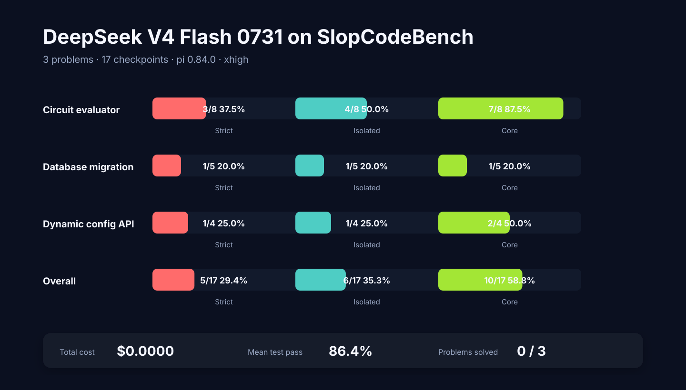
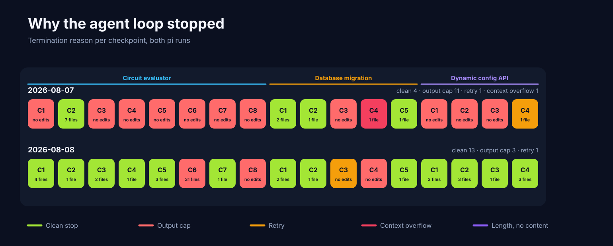
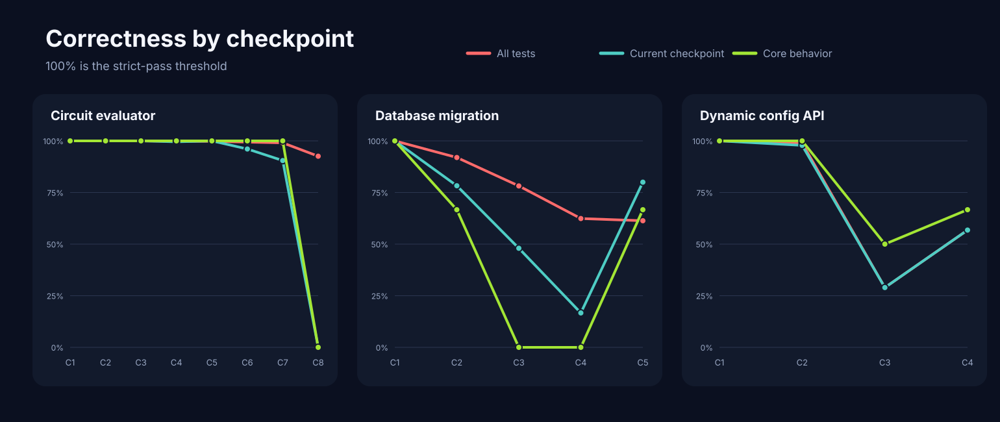
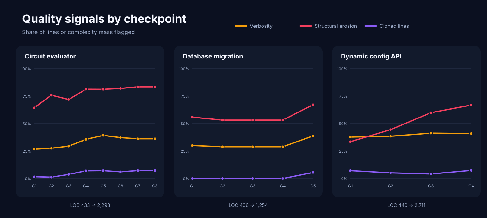
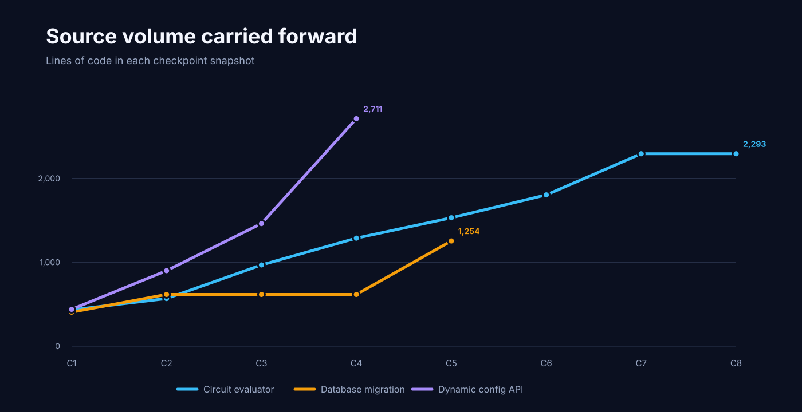

# Running DeepSeek V4 Flash 0731 locally on SlopCodeBench



## The same model scored 1/17 and 5/17 in two runs a day apart

I ran DeepSeek V4 Flash 0731 against the same three-problem, 17-checkpoint
SlopCodeBench subset used in my
[earlier DeepSeek V4 Flash report](deepseek-v4-flash-on-slop-code-bench.md) —
but where that run used the full model served by the DeepSeek API, this one
served a quantized copy on my own hardware, under the `pi` agent instead of
OpenCode. So the two reports are not a quantization A/B; too much differs.

This one is about something else entirely, which is why it is worth writing up.

The first run strictly solved **1 of 17 checkpoints**. The second, the next
day, strictly solved **5 of 17**. The weights did not change.

That gap is the report. Almost none of it is about how well the model writes
code, and most of it is about a single number in a serving config: the cap on
how many tokens the model is allowed to emit in one response.

| Metric | Run A (2026-08-07) | Run B (2026-08-08) |
| --- | ---: | ---: |
| Strict checkpoints solved | 1/17 (5.9%) | **5/17 (29.4%)** |
| Isolated checkpoints solved | 1/17 (5.9%) | **6/17 (35.3%)** |
| Core checkpoints solved | 2/17 (11.8%) | **10/17 (58.8%)** |
| Fully solved problems | 0/3 | 0/3 |
| Partially solved problems | 1/3 | 3/3 |
| Mean per-checkpoint test pass rate | 24.9% | **86.4%** |
| Raw test executions passed | 360/3,569 (10.1%) | **3,306/3,569 (92.6%)** |
| Checkpoints with an empty file diff | 11/17 | **3/17** |
| Agent loops killed by the output cap | 11/17 | **3/17** |
| Agent loops that ran to a normal stop | 4/17 | **13/17** |
| Total output tokens | 777,346 | 1,336,035 |
| Summed agent time | 6h 47m | 10h 58m |
| Cost | $0.00 (local) | $0.00 (local) |

Both runs executed exactly 3,569 tests, so the 10.1% → 92.6% row is
like-for-like rather than an artifact of counting different things.

## What I ran

Both runs used:

- model: DeepSeek V4 Flash 0731, quantized, on consumer hardware
- server: a local OpenAI-compatible inference server with speculative decoding
- agent: `pi` 0.84.0, with an isolated agent config directory
- reasoning effort: maximum
- prompt: SlopCodeBench's minimal `just-solve` prompt
- environment: Python 3.12 in Docker
- seed: 42
- context window: 131,072 tokens
- per-checkpoint limits: none on cost or steps; 7,200s process timeout

Each problem advanced through its checkpoints sequentially, carrying the
model's code forward:

- `circuit_eval` — 8 checkpoints
- `database_migration` — 5 checkpoints
- `dynamic_config_service_api` — 4 checkpoints

Run B took 11 hours of wall clock, against about 90 minutes for the hosted
OpenCode run in the earlier report. Local inference is free per token and
expensive per hour.

## Why strict correctness is the result that matters

[SlopCodeBench](https://arxiv.org/abs/2603.24755) makes each checkpoint add
requirements to the code the agent wrote at the previous checkpoint. The model
sees the new specification and its existing workspace, but not the future
requirements or the hidden tests. The evaluator reports three thresholds:

- **Strict:** every test passes, including regressions inherited from earlier
  checkpoints.
- **Isolated:** all current-checkpoint tests pass after excluding regressions.
- **Core:** all tests for behavior explicitly shown or stated in the current
  specification pass.

Core asks whether the agent implemented the obvious contract. Strict asks
whether it extended the system without leaving a defect anywhere.

## A reasoning model with a small output budget is not an agent

The failure in run A has a mechanical cause. This model returns its reasoning
inside the same token budget as its visible response — the server charges
thinking to `output`. At maximum reasoning effort it routinely wants more than
32,768 tokens for the reasoning block alone.

So with a 32,768-token output cap, the sequence is: the model starts thinking,
fills the entire budget, gets truncated mid-sentence, and never reaches the
part of the response where it would have called a tool. The agent harness
receives a message with nothing to execute and the loop ends.

That happened on **11 of 17 checkpoints** in run A. Eleven checkpoints produced
an empty file diff; five snapshots contained no Python file at all. Run B
raised the cap to 49,152 tokens and the same failure occurred 3 times.



The scoring system did not notice. Every one of those dead checkpoints was
recorded as `state: ran`, `had_error: false`, `passed_policy=True`, and each
problem's log signed off with `All checkpoints completed successfully`. A
truncated turn with nothing to execute is an infrastructure failure wearing a
score.

## Two things changed between the runs, not one

I would like to report run B as a clean single-variable experiment. It is not,
and the way I found out is worth repeating.

| | Run A | Run B |
| --- | --- | --- |
| Max output tokens | 32,768 | **49,152** |
| Compaction reserve tokens | 16,384 (harness default) | **49,152** |
| Quant | vendor `UD-Q2_K_XL` | **a larger community q2q4 imatrix quant (91 GB)** |
| Weights, server, drafter | unchanged | unchanged |
| Harness, prompt, seed, problems, effort | unchanged | unchanged |

I nearly published this as a controlled experiment, because **the two runs'
`config.yaml` files are byte-identical apart from the run identifier**.
SlopCodeBench does not record which weights actually served a run. The only
durable evidence is a `model` field buried in the agent's event stream, which
is not part of the committed artifacts.

An identical `config.yaml` is not evidence of an identical setup. If you
publish agent benchmarks, record the served model identifier next to the score.

### How much belongs to the cap

The two changes are not equally plausible explanations for each effect, and the
trajectory data separates them for one of the two.

**The disappearance of the truncation failures belongs to the cap.** A larger
quant would only prevent a truncation if it made the model reason more briefly,
and it did not. Under the new quant the model still emits enormous single
thinking blocks — 201,509 characters on one checkpoint, 186,476 on another —
and total reasoning volume went *up*, from 2.03M characters to 3.31M. Those
blocks would have hit a 32,768-token ceiling just as hard.

**The correctness gains are confounded.** Once loops stop dying at token
32,768, more of them do useful work, and that alone raises every correctness
number. Whether the new quant also writes better code cannot be answered from
these two runs, because no run has paired the new quant with the old cap, or
the old quant with the new cap.

What the pair does establish is the weaker but still useful claim: 5.9% was a
serving artifact, not a capability ceiling.

## The cap still binds, three times out of seventeen

Run B's three remaining cap deaths all report exactly `output: 49152` — they
hit the new ceiling, not the old one.

| Checkpoint | Total thinking | Largest single block | Files changed |
| --- | ---: | ---: | ---: |
| `circuit_eval` 6 | 278,018 ch | 186,476 ch | 31 |
| `circuit_eval` 8 | 380,452 ch | 184,516 ch | 0 |
| `database_migration` 4 | 201,602 ch | 201,509 ch | 0 |
| `circuit_eval` 1 (for contrast) | 171,659 ch | 157,736 ch | 4 |

At roughly 4 characters per token, 49,152 tokens is about 196,600 characters,
which brackets the blocks that died and sits just clear of the 157k block that
finished normally. The headroom is thin, and raising the cap again is not the
fix: 49,152 already commits the whole 131,072-token context window once the
compaction reserve is counted. The lever is shorter reasoning, not a bigger
budget for it.

`circuit_eval` 6 is worth separating from the other two: it changed 31 files
before being truncated. A capped loop is not automatically a wasted one.

## One checkpoint read for fifty minutes and wrote nothing

The strangest row in run B is `circuit_eval` checkpoint 8: strict pass rate
0.926, isolated 0.000, core 0.000. Every inherited test passed and every new
test failed.

That is what a completely unimplemented checkpoint looks like when the
regression suite is large enough to carry the headline number. The trajectory
confirms it: 21 assistant messages, 22 tool calls, every one a read or a shell
command — **zero writes or edits** — then a 49,152-token thinking block and a
truncation. The evaluator collected 539 tests with no infrastructure failure,
and the checkpoint-8 tests fail with `unknown command: opt` and
`unknown flag: --pipeline`. Core 0/17, functionality 0/18, regression 524/529.

An agent that reads for fifty minutes and writes nothing should not score
0.926 on anything.

## The result by problem

| Problem | Strict | Isolated | Core | Final tests passing |
| --- | ---: | ---: | ---: | ---: |
| `circuit_eval` | 3/8 | 4/8 | 7/8 | 524/566 (92.6%) |
| `database_migration` | 1/5 | 1/5 | 1/5 | 84/137 (61.3%) |
| `dynamic_config_service_api` | 1/4 | 1/4 | 2/4 | 46/81 (56.8%) |
| **Total** | **5/17** | **6/17** | **10/17** | — |



`circuit_eval` is the strong trajectory: three clean strict passes, then core
passes on every checkpoint through 7 while small defects kept it from strict.
It also held its regression suite unusually well — 524 of 529 inherited tests
still passed at checkpoint 8, the checkpoint where it wrote no code at all.

`database_migration` is the weak one. It strict-passes checkpoint 1 and then
holds 1/5 across all three criteria. Checkpoint 4 is the textbook version of
the cap failure: five steps, two tool calls — a directory listing and a single
file read — then a 201,509-character thinking block and a truncation.
Forty-three minutes to read one file and think about it.

Two things in this run I could not explain from the artifacts, and I would
rather flag them than guess. `database_migration` checkpoint 3 is
unanalysable because the harness overwrote the agent's event log on a retry.
And all four `dynamic_config_service_api` checkpoints end with the agent
mid-tool-call, with no error recorded and well inside the timeout; I could not
determine whether those loops were cut short.

## The slop meter

SlopCodeBench tracks **verbosity** (the share of lines implicated by
duplication or targeted static rules) and **structural erosion** (the share of
complexity mass held by high-complexity functions). Across run B's 17
snapshots the model averaged 34.2% verbosity, 65.3% erosion, and 0.133 lint
findings per line of code.

| Problem | LOC | Max CC | Verbosity | Erosion | Cloned lines |
| --- | ---: | ---: | ---: | ---: | ---: |
| `circuit_eval` | 433 → 2,293 | 19 → 71 | 26.6% → 36.1% | 64.3% → 83.4% | 1.6% → 7.3% |
| `database_migration` | 406 → 1,254 | 18 → 24 | 30.0% → 38.7% | 55.8% → 67.1% | 0.0% → 5.5% |
| `dynamic_config_service_api` | 440 → 2,711 | 12 → 46 | 37.7% → 40.9% | 33.5% → 66.7% | 7.2% → 7.5% |





Every trajectory ended more verbose, more eroded, more duplicated and more
complex than it started, which matches the earlier OpenCode run and the
benchmark paper's broader finding. Read these as directional: three
trajectories from one run is evidence, not an estimate.

One caveat specific to this run — several snapshots are unchanged copies of
the previous checkpoint, because the agent was truncated before writing
anything. Averages over 17 snapshots therefore double-count some code and
should not be compared too precisely against runs where every checkpoint
produced new work.

## Compared with the other reported runs

| Reported run | Serving | Harness | Strict | Isolated | Core |
| --- | --- | --- | ---: | ---: | ---: |
| DeepSeek V4 Flash 0731 (run B) | local quant | pi 0.84.0 | 5/17 (29.4%) | 6/17 | 10/17 |
| Opus 5 | hosted API | Claude Code | 4/17 (23.5%) | — | — |
| DeepSeek V4 Flash | hosted API | OpenCode 1.18.10 | 3/17 (17.6%) | 6/17 | 11/17 |
| Opus 4.8 | hosted API | Claude Code | 1/17 (5.9%) | — | — |
| Sonnet 5 | hosted API | Claude Code | 1/17 (5.9%) | — | — |
| DeepSeek V4 Flash 0731 (run A) | local quant | pi 0.84.0 | 1/17 (5.9%) | 1/17 | 2/17 |

The Anthropic rows come from
[HumanLayer's Opus 5 report](https://github.com/humanlayer/advanced-context-engineering-for-coding-agents/blob/main/benchmarking-opus-5-on-slop-code-bench.md).

Resist reading this as a ranking. Every row is a single trajectory, and the
rows differ in weights, quantization, harness and reasoning effort all at once.

The most tempting comparison — my own earlier DeepSeek V4 Flash report — is
also one of the least controlled. **That run used the full model served by the
DeepSeek API**; this one used a roughly 2-bit local quantization on consumer
hardware. It also used a different harness (OpenCode rather than pi) and a
lower reasoning effort. Four variables move at once.

With that caveat, the local quant scored higher on strict (5 vs 3), tied on
isolated (6), and lower on core (10 vs 11). Strict rewards not breaking
inherited behavior; core rewards implementing the current contract — the API
run implemented more of each checkpoint and broke more of what came before.

I would not conclude from this that a 2-bit local quant matches the hosted
model. Seventeen checkpoints is far too small a sample, and three of this run's
checkpoints were decided by a token cap rather than by the weights. The
defensible reading is narrower: on this subset the quantized local model was
not obviously outclassed, and the serving configuration mattered more than the
gap between the two.

## What I take away

The headline number of a coding-agent benchmark can be dominated by a serving
parameter that has nothing to do with the model. A 4× swing in strict
correctness came from an output-token cap and a quantization change, over a
single day, on identical weights and an identical prompt.

Three practical conclusions:

1. **Publish the serving configuration, and record it in the artifacts.** Output
   cap, context window, quantization, reasoning effort. Two of my runs are
   indistinguishable from their committed configs and differ by 4 checkpoints.
2. **A truncated turn with no tool call should fail the checkpoint, not score
   it.** Fourteen checkpoints across these two runs were scored despite the
   agent never acting, and one of them reported a 0.926 pass rate.
3. **Reasoning effort is not free inside an agent loop.** When reasoning and
   tool calls share an output budget, maximum effort buys thinking at the
   direct expense of acting.

None of this suggests the weights are the problem. It suggests that serving
configuration is a first-class variable in agentic benchmarks, and that
publishing a score without it is publishing half a result.

## Reproduce the analysis

Aggregates for both runs are committed under
[`data/deepseek-v4-flash-0731-pi-xhigh-2026-08-07/`](data/deepseek-v4-flash-0731-pi-xhigh-2026-08-07)
and
[`data/deepseek-v4-flash-0731-pi-xhigh-2026-08-08/`](data/deepseek-v4-flash-0731-pi-xhigh-2026-08-08):
`result.json`, `checkpoint_results.jsonl` and `config.yaml` from the run, plus
a normalized `checkpoints.csv` and a `trajectory.jsonl` summarizing each
agent loop. Absolute paths in `config.yaml` are rewritten
repository-relative; nothing else is modified.

The agent-loop facts — stop reasons, reasoning volume, tool calls, files
changed — are summarized from the agent's event stream, which is roughly 30 MB
per run and is therefore not committed.

```bash
# regenerate checkpoints.csv and trajectory.jsonl from a run directory
python scripts/extract_run.py <run-dir> data/deepseek-v4-flash-0731-pi-xhigh-2026-08-08

# regenerate the figures
python scripts/render_charts.py data/deepseek-v4-flash-0731-pi-xhigh-2026-08-08
```

No third-party Python packages are required.

## Links

- [SlopCodeBench paper](https://arxiv.org/abs/2603.24755)
- [SlopCodeBench runner](https://github.com/SprocketLab/slop-code-bench)
- [SlopCodeBench problems](https://github.com/gabeorlanski/scb-problems)
- [DeepSeek V4 Flash on SlopCodeBench (OpenCode)](deepseek-v4-flash-on-slop-code-bench.md)
