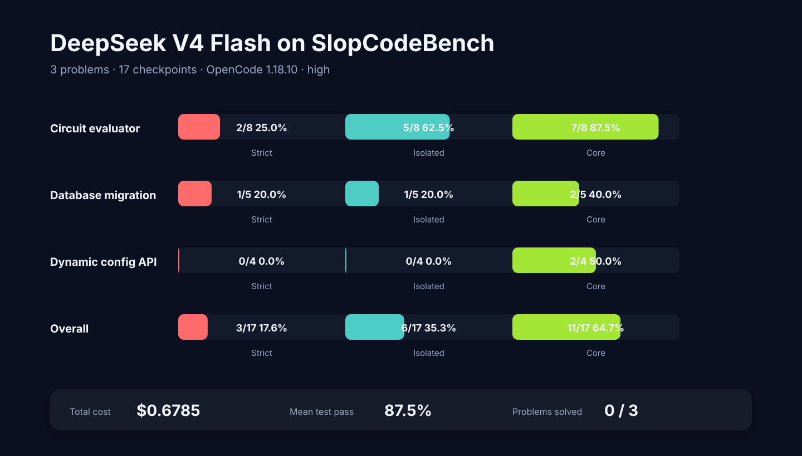
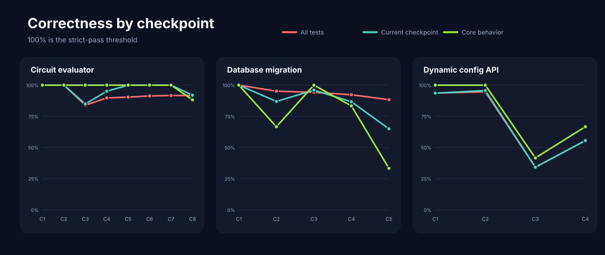
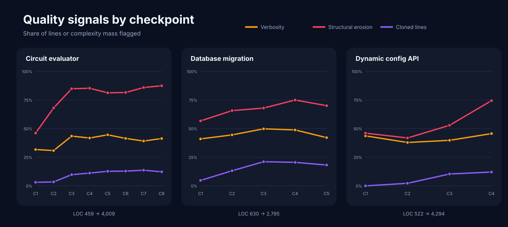
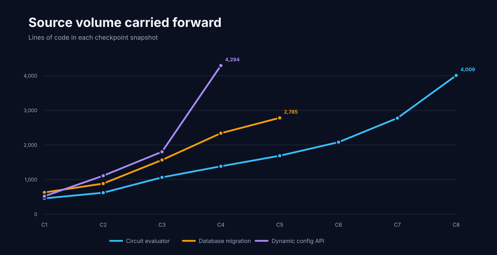

# Benchmarking DeepSeek V4 Flash on SlopCodeBench



## $0.68 bought a lot of partial correctness

The runner ended with a cheerful message: “All 3 problems completed
successfully.”

That sentence described the jobs, not the solutions.

DeepSeek V4 Flash finished every requested checkpoint without a harness error,
but it strictly solved only **3 of 17 checkpoints (17.6%)** and **zero of three
problems end to end**. It did much better on weaker correctness criteria:
6 checkpoints passed in isolation, and 11 passed their core tests.

The compact scorecard is:

| Metric | Result |
| --- | ---: |
| Strict checkpoints solved | 3/17 (17.6%) |
| Isolated checkpoints solved | 6/17 (35.3%) |
| Core checkpoints solved | 11/17 (64.7%) |
| Fully solved problems | 0/3 |
| Partially solved problems | 2/3 |
| Mean test pass rate | 87.5% |
| Total cost | $0.6785 |
| Mean cost per checkpoint | $0.0399 |
| Mean active time per checkpoint | 12m 32s |

This is the same three-problem, 17-checkpoint subset used in
[HumanLayer’s Opus 5 report](https://github.com/humanlayer/advanced-context-engineering-for-coding-agents/blob/main/benchmarking-opus-5-on-slop-code-bench.md).
That makes it an interesting follow-up, but not a controlled model ranking:
the model, agent harness, and run date differ, and each result is a single
trajectory.

## Why strict correctness is the result that matters

[SlopCodeBench](https://arxiv.org/abs/2603.24755) reveals a software problem a
one-shot benchmark cannot: each checkpoint adds requirements to the code the
agent wrote at the previous checkpoint. The model sees the new specification
and its existing workspace, but not the future requirements or the hidden
tests.

The evaluator reports three useful thresholds:

- **Strict:** every test passes, including regressions inherited from earlier
  checkpoints.
- **Isolated:** all current-checkpoint tests pass after excluding regressions.
- **Core:** all tests for behavior explicitly shown or stated in the current
  specification pass.

Core therefore asks, “did the agent implement the obvious contract?” Strict
asks, “did it extend the system without leaving a defect anywhere?” For
unattended maintenance, the second question is the one I care about.

## What I ran

The run used:

- model: `deepseek-v4-flash`
- agent: OpenCode 1.18.10
- reasoning effort: high
- prompt: SlopCodeBench’s minimal `just-solve` prompt
- environment: Python 3.12 in Docker
- seed: 42
- per-checkpoint limits: $20 and 250 agent steps

The three problems started concurrently. Each problem advanced through its
checkpoints sequentially, carrying the model’s code forward:

- `circuit_eval` — 8 checkpoints, labeled easy
- `database_migration` — 5 checkpoints, labeled medium
- `dynamic_config_service_api` — 4 checkpoints, labeled hard

The slowest problem finished in 87 minutes of wall-clock time. Summed across
the three concurrent trajectories, the checkpoints consumed 3h 33m of active
agent time, 814 steps, 710,044 input tokens, 420,037 output tokens, and 837,621
reasoning tokens.

The exact [run configuration](data/deepseek-v4-flash-opencode-high-2026-07-31/config.yaml),
[aggregate result](data/deepseek-v4-flash-opencode-high-2026-07-31/result.json),
and [checkpoint records](data/deepseek-v4-flash-opencode-high-2026-07-31/checkpoint_results.jsonl)
are included in this repository.

## The result by problem

| Problem | Strict | Isolated | Core | Final tests passing | Cost |
| --- | ---: | ---: | ---: | ---: | ---: |
| `circuit_eval` | 2/8 | 5/8 | 7/8 | 519/566 (91.7%) | $0.2820 |
| `database_migration` | 1/5 | 1/5 | 2/5 | 121/137 (88.3%) | $0.1830 |
| `dynamic_config_service_api` | 0/4 | 0/4 | 2/4 | 45/81 (55.6%) | $0.2136 |
| **Total** | **3/17** | **6/17** | **11/17** | — | **$0.6785** |



The gap between the green core line and the strict 100% threshold is the
story. The agent usually implemented a large portion of the requested
behavior. Small defects were enough to make a checkpoint strictly incorrect,
and those defects then traveled forward.

## One naming collision poisoned six checkpoints

`circuit_eval` opened perfectly: checkpoint 1 passed 36/36 tests, and
checkpoint 2 passed 99/99, including checkpoint 1’s regression suite.

Checkpoint 3 added vector signals and an uppercase `EQ` operator. The updated
parser lowercased identifiers before checking whether they were operators. An
existing circuit already used the legal, case-sensitive signal name `eq`.
The parser began treating that signal as an operator and returned:

> CircParseError: expected '(' after operator 'eq'

That one collision caused 33 failures at checkpoint 3, including inherited
comparator tests. The new work was otherwise strong enough that checkpoints
5, 6, and 7 each passed in isolation, but none could pass strictly while the
old comparator remained broken. Checkpoint 8 finally missed core and isolated
tests too.

This is precisely the kind of failure an iterative benchmark exposes. A
feature can look mostly correct at its own zoom level while a small parser
decision quietly invalidates the maintained system.

## The database trajectory missed one clean event contract

`database_migration` passed checkpoint 1, then lost strict correctness at
checkpoint 2.

Two failures came from adding a `column` field that the JSONL event contract
did not permit. The third was more substantive: a transform targeting a
nonexistent column returned success instead of failing. Later checkpoints
recovered enough explicit behavior to pass core at checkpoint 3, but the
trajectory never returned to a strict or isolated pass.

## The hard problem was defective from the start

`dynamic_config_service_api` passed 44 of 47 tests at checkpoint 1, but three
version-resolution cases failed. One concrete example: asking to resolve an
explicit version should have returned 200, but the implementation rejected it
with a 409 unless the caller also supplied `dry_run=true`.

There was no clean checkpoint to build on. The model still passed the core
criterion at checkpoints 1 and 2, then dropped to 26/76 tests at checkpoint 3
before recovering to 45/81 at checkpoint 4. The final checkpoint was also the
most expensive and slowest of the run: $0.0968, 113 steps, and 34 minutes.

## Cheap did not mean small

The entire run cost less than one dollar, which is notable for more than three
and a half hours of concurrent agent work. The distribution was uneven:

- cheapest checkpoint: $0.0070
- median checkpoint: $0.0328
- most expensive checkpoint: $0.0968
- shortest checkpoint: 2m 27s
- longest checkpoint: 34m 10s

The agent also read 81.1 million cached tokens. Token price made this run
cheap; it did not make the trajectory lightweight.

The last checkpoints were particularly expensive. `circuit_eval` checkpoint
8 and `dynamic_config_service_api` checkpoint 4 together consumed 27.9% of
the run’s cost. Neither passed even the isolated criterion.

## The slop meter moved in one direction

SlopCodeBench tracks two primary trajectory-level quality signals.
**Verbosity** is the share of lines implicated by duplication or targeted
static rules. **Structural erosion** is the share of complexity mass held by
high-complexity functions. They are useful indicators, not a complete oracle
for maintainability.

Across all 17 snapshots, DeepSeek V4 Flash averaged:

- 41.6% verbosity
- 68.9% structural erosion
- 0.150 lint findings per line of code

More interesting than the mean is the first-to-final trajectory:

| Problem | LOC | Max CC | Verbosity | Erosion | Cloned lines |
| --- | ---: | ---: | ---: | ---: | ---: |
| `circuit_eval` | 459 → 4,009 | 14 → 87 | 31.7% → 41.4% | 46.1% → 87.4% | 3.2% → 12.3% |
| `database_migration` | 630 → 2,785 | 14 → 36 | 41.0% → 42.2% | 56.8% → 70.0% | 4.8% → 18.2% |
| `dynamic_config_service_api` | 522 → 4,294 | 15 → 68 | 43.7% → 45.6% | 46.1% → 74.5% | 0.0% → 12.1% |



Every trajectory ended with higher verbosity, erosion, duplication, maximum
cyclomatic complexity, and source volume than it started with. Some growth is
obviously required—the later specifications do more—but the complexity mass
and duplication grew faster than a reassuring maintenance story would allow.

`circuit_eval` is the clearest example. Source volume grew 8.7× while its
function count grew from 10 to 109. More decomposition did not prevent the
maximum cyclomatic complexity from rising from 14 to 87 or erosion from
reaching 87.4%.



This run is consistent with the benchmark paper’s broader result that quality
often deteriorates over iterative agent trajectories. It is still only three
trajectories from one run, so it should be treated as evidence, not a general
estimate of the model.

## Compared with the Opus 5 run

The HumanLayer report recorded four strict passes for Opus 5 on this subset:
the first three `circuit_eval` checkpoints and `database_migration` checkpoint
1. DeepSeek V4 Flash recorded three: the first two `circuit_eval` checkpoints
and the same database checkpoint.

| Reported run | Strict checkpoints |
| --- | ---: |
| Opus 5 | 4/17 (23.5%) |
| DeepSeek V4 Flash | 3/17 (17.6%) |
| Opus 4.8 | 1/17 (5.9%) |
| Sonnet 5 | 1/17 (5.9%) |

The one-checkpoint gap between Opus 5 and DeepSeek V4 Flash is smaller than it
sounds: one parser collision accounts for it. It is also too small a sample to
support a confident ordering. Different harnesses are an especially important
confounder here—HumanLayer used Claude Code, while this run used OpenCode.

What the runs do agree on is more useful than the tiny leaderboard: no model
finished any of the three problems with a fully correct codebase.

## What I take away

DeepSeek V4 Flash was good at implementing the visible center of a
specification. A 64.7% core solve rate and an 87.5% mean test pass rate are not
random behavior.

But maintenance is an all-tests discipline. The first strict failures came
from three compact defect clusters: a case-insensitive parser collision, an
output-contract mismatch plus missing validation, and an over-restrictive
version rule. Later checkpoint work could be correct in isolation without
repairing inherited behavior, and it eventually added failures of its own.

At $0.68, the model is economically interesting. At 0/3 end-to-end solves, it
is not yet a lights-off maintainer on this sample. Cheap partial correctness is
still partial correctness.

## Reproduce the analysis

The repository includes the raw aggregate files, a normalized
[CSV](data/deepseek-v4-flash-opencode-high-2026-07-31/checkpoints.csv), and the
[chart generator](scripts/render_charts.py). Regenerate the figures with:

```bash
python scripts/render_charts.py
```

No third-party Python packages are required.

## Links

- [SlopCodeBench paper](https://arxiv.org/abs/2603.24755)
- [SlopCodeBench runner](https://github.com/SprocketLab/slop-code-bench)
- [SlopCodeBench problems](https://github.com/gabeorlanski/scb-problems)
- [HumanLayer’s Opus 5 benchmark report](https://github.com/humanlayer/advanced-context-engineering-for-coding-agents/blob/main/benchmarking-opus-5-on-slop-code-bench.md)
