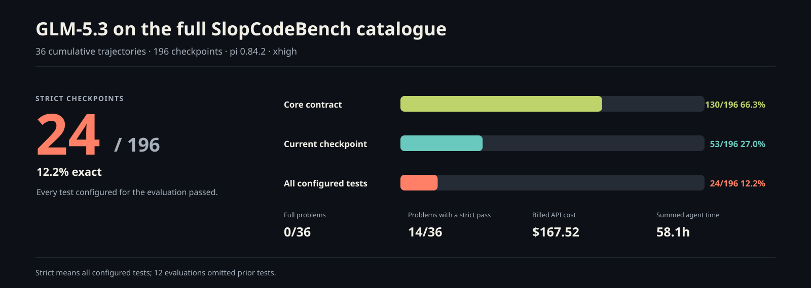
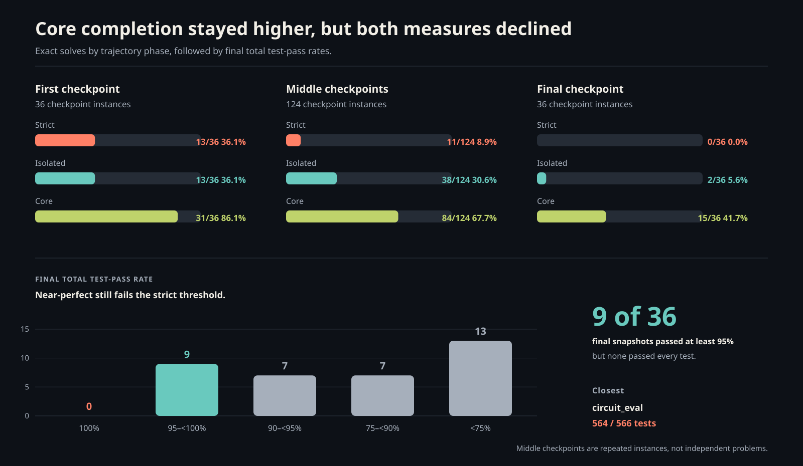
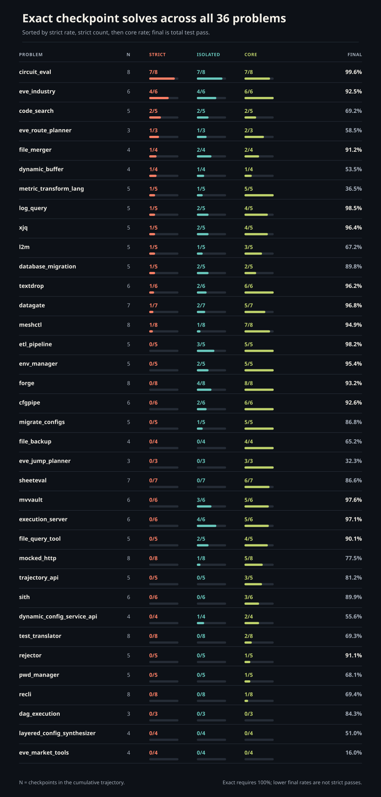
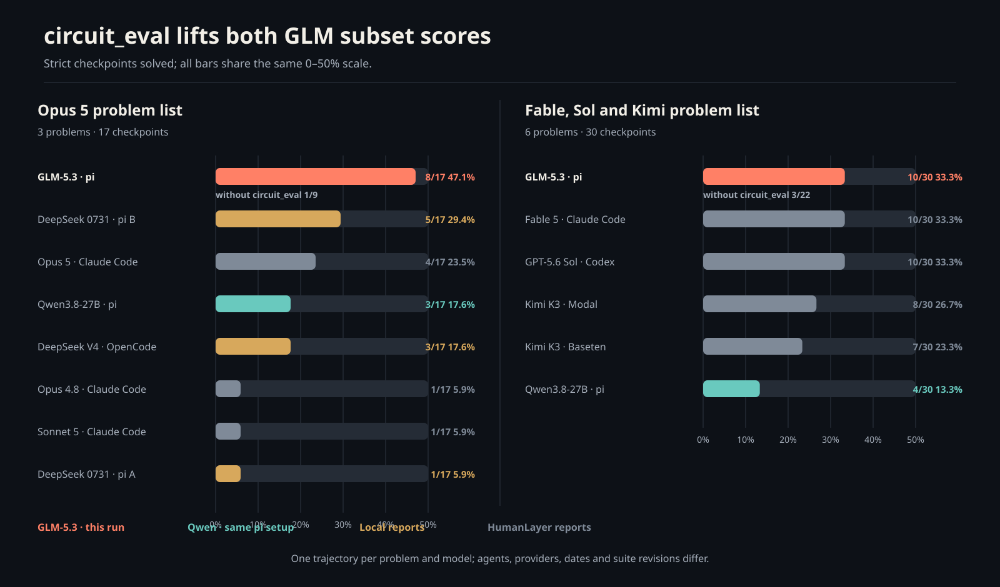

# Benchmarking GLM-5.3 with pi on the full SlopCodeBench catalogue



## GLM usually found the centre of a requirement; exact maintenance was much harder

GLM-5.3 strictly solved **24 of 196 checkpoints (12.2%)** across the complete
36-problem catalogue. It solved 53 checkpoints when inherited regressions were
excluded and 130 at the narrower core-contract level. No problem remained
strictly correct throughout its whole trajectory.

That 130 → 53 → 24 funnel is the result. GLM often implemented the explicit
centre of a feature, but the rest of the visible behaviour and compatibility
with work already in the repository were much less reliable.

| Metric | Result |
| --- | ---: |
| Strict checkpoints | **24/196 (12.2%)** |
| Isolated checkpoints | **53/196 (27.0%)** |
| Core checkpoints | **130/196 (66.3%)** |
| Fully solved problems | **0/36** |
| Problems with a strict pass | **14/36** |
| Mean checkpoint test-pass rate | **86.0%** |
| Billed API cost | **$167.5153** |
| Summed agent time | **58.1h** |
| Agent steps | **17,373** |
| Output tokens | **11.86M** |

## How to read the score

Each problem is an evolving coding trajectory. A checkpoint reveals one new
specification to the agent, which continues from the workspace produced at the
previous checkpoint.

The evaluator exposes three exact thresholds:

- **Strict:** every test configured for the checkpoint passes, including prior
  tests when the catalogue carries them forward.
- **Isolated:** every current-checkpoint test passes, excluding regressions.
- **Core:** every test for the explicit central contract passes.

These are 100% thresholds, not average pass rates. A 564/566 result is therefore
close, but not solved. Strict is the useful headline for unattended maintenance
because a small inherited defect is still a real defect.

One catalogue detail matters: 12 checkpoint evaluations across six problems set
`include_prior_tests: false`. Their workspaces still accumulated, but their
strict result did not retest the full history. The published
[`checkpoint_metadata.csv`](data/glm-5.3-pi-xhigh-2026-08-19/checkpoint_metadata.csv)
identifies every reset. This is why `meshctl` checkpoint 7’s 42/42 pass should
not be read as proof that all earlier behaviour was repaired.

## What I ran

| Setting | Value |
| --- | --- |
| Model | `openrouter/z-ai/glm-5.3` |
| Agent | pi 0.84.2 |
| Reasoning | xhigh |
| Prompt | SlopCodeBench `just-solve` |
| Environment | Python 3.12 in Docker |
| Pass policy | `all-cases` |
| Seed | 42 |
| Cost / step limit | none |
| Per-attempt process timeout | 7,200 seconds |
| Problem catalogue | `v1.0` at `4d38d300` |

All 196 expected checkpoints completed and were evaluated. The agent-inference
window was 9h 56m; summed inference time is larger because problem trajectories
overlapped. Fourteen checkpoints continued after a failed attempt. Their
retained event streams begin at the continuation, so the original causes are
unavailable; the 7,200-second limit applied to each attempt. No evaluation
itself was lost or classified as an infrastructure failure.

The [configuration](data/glm-5.3-pi-xhigh-2026-08-19/config.yaml),
[provenance](data/glm-5.3-pi-xhigh-2026-08-19/source_manifest.json),
[aggregate](data/glm-5.3-pi-xhigh-2026-08-19/result.json), and all 196
[checkpoint records](data/glm-5.3-pi-xhigh-2026-08-19/checkpoint_results.jsonl)
are published with this report. The runner did not record its git revision; the
source workspace was dirty and its exact runtime patch is unavailable. The
manifest pins the provider slug, container digests, catalogue commit, and
retained effective configuration, but an exact benchmark rerun cannot be
guaranteed.

## The full catalogue



Strict success was concentrated rather than broad:

- `circuit_eval` supplied **7 of 24** strict passes, remaining exact through
  checkpoint 7 before finishing at 564/566.
- `eve_industry` supplied another **4**, then missed four new build-planning
  cases at checkpoint 5 and carried them into checkpoint 6.
- Thirteen problems passed their first checkpoint strictly. Every one had lost
  exactness by its final checkpoint.
- Outside `circuit_eval` and `eve_industry`, only `code_search` checkpoint 2 and
  the non-cumulative `meshctl` checkpoint 7 were later strict passes.

The failures were often much closer than a 12.2% headline suggests. Of 172
non-strict checkpoints, **60 passed at least 95% of their tests** and **37
missed only one or two tests**. At the final checkpoint, nine problems still
passed at least 95%; none passed 100%.



### Small defects became long-lived regressions

There were **29 checkpoints** that passed the new requirement in isolation but
failed inherited tests. `execution_server` is the cleanest example. Its first
checkpoint missed two null-validation cases. Checkpoints 2–5 each passed their
new tests, yet the same pair remained as regressions and prevented five strict
passes.

`etl_pipeline` finished **161/164**. Its final feature passed every current core,
functionality, and error test; three older validation failures were all that
separated it from strict correctness.

### A complete core was often an incomplete feature

Another **77 checkpoints** passed every core test but did not pass the rest of
the current requirement. `file_backup` was **4/4 core** but **0/4 isolated**:
scheduling boundaries, glob semantics, validation, and event behaviour remained
incomplete. `eve_jump_planner` was similarly **3/3 core** and **0/3 isolated**.

This is why publishing core beside strict matters. Core shows that GLM often
satisfied the feature’s central contract. The drop to isolated shows that the
implementation did not reliably cover the full visible contract.

### Broad extensions coincided with failures in several trajectories

`code_search` strictly passed exact/regex search and its first language
extension. Structural metavariable matching then reduced total correctness to
89.4%; selectors and automated fixes reduced it to 65.3%.

`dynamic_buffer` passed its 30-test opening checkpoint, then lost ground as
stateful transforms, C++/Rust generation, and advanced windows arrived. It
finished at **92/172** after costing **$19.04**. `test_translator`, another
multi-language generation task, reached **0/8 strict** for **$15.10**.

The same shape appears in `metric_transform_lang`: the first three checkpoints
were exact or nearly exact. Multi-source joins and later resume/versioning work
left the new feature almost complete, but only 2/48 inherited tests passed at
the final checkpoint.

In these selected examples, broad architectural extensions coincided with
losses in correctness. They do not establish how frequently that pattern
occurred across the catalogue or prove that multi-language work caused the
failures.

## Difficulty and effort

The catalogue’s difficulty labels tracked core completion and effort more
cleanly than strict score:

| Difficulty | Problems | Checkpoints | Strict | Core | Mean steps / checkpoint | Cost |
| --- | ---: | ---: | ---: | ---: | ---: | ---: |
| Easy | 12 | 67 | 6/67 | **58/67 (86.6%)** | 47 | $19.68 |
| Medium | 12 | 57 | 11/57 | **35/57 (61.4%)** | 81 | $43.14 |
| Hard | 12 | 72 | 7/72 | **37/72 (51.4%)** | 134 | $104.69 |

Medium’s strict count is not evidence that medium problems were easiest:
`circuit_eval` alone contributed 7 of its 11 passes. Core results show the
broader trend, while mean steps rose almost threefold from easy to hard.

Spend did not imply recovery. The five most expensive trajectories—`sith`,
`dynamic_buffer`, `test_translator`, `mocked_http`, and `recli`—consumed
**$72.19 (43.1% of the bill)** across 34 checkpoints and produced one strict
pass. Cost is confounded by problem size and retries; it is evidence of effort,
not a quality metric.

## Comparison with the published subsets



On the three-problem, 17-checkpoint list from the
[Opus 5 report](https://github.com/humanlayer/advanced-context-engineering-for-coding-agents/blob/f2bc7aec4575418d2d2e83fec078266cc56d3e6a/benchmarking-opus-5-on-slop-code-bench.md),
GLM scored **8/17 strict (47.1%)**. On the six-problem, 30-checkpoint list from
the
[Fable, Sol, and Kimi report](https://github.com/humanlayer/advanced-context-engineering-for-coding-agents/blob/f2bc7aec4575418d2d2e83fec078266cc56d3e6a/benchmarking-sol-fable-kimi-on-slop-code-bench.md),
it scored **10/30 (33.3%)**, tied at the strict threshold with Fable 5 and
GPT-5.6 Sol.

| Reported system | Opus list · 17 | Fable/Sol/Kimi list · 30 |
| --- | ---: | ---: |
| **GLM-5.3 · pi** | **8 (47.1%)** | **10 (33.3%)** |
| DeepSeek V4 Flash 0731 · pi B | 5 (29.4%) | — |
| Opus 5 · Claude Code | 4 (23.5%) | — |
| Qwen3.8-27B · pi | 3 (17.6%) | 4 (13.3%) |
| DeepSeek V4 Flash · OpenCode | 3 (17.6%) | — |
| Fable 5 · Claude Code | — | 10 (33.3%) |
| GPT-5.6 Sol · Codex | — | 10 (33.3%) |
| Kimi K3 · Modal / OpenCode | — | 8 (26.7%) |
| Kimi K3 · Baseten / OpenCode | — | 7 (23.3%) |

The subset score needs context. `circuit_eval` contributes seven strict passes
to both lists. Remove it and GLM scores **1/9** on the remaining Opus problems
and **3/22** on the remaining Fable/Sol/Kimi problems—close to its 12.2%
full-catalogue rate. The attractive subset numbers mostly describe one standout
trajectory, not uniform superiority across problem types.

The closest available comparison is Qwen: the same pi version, reasoning level,
prompt, environment, policy, and catalogue. On the eight-problem union, GLM
scored **11/39 strict** versus Qwen’s **5/39**. These are single observed
trajectories per problem and model, with no replicates; Qwen’s union was also
pooled from two run invocations. This is not a variance-controlled experiment.

The wider table is a system comparison, not a model ranking. Agents, providers,
reasoning settings, run dates, and benchmark revisions differ. In particular,
`circuit_eval` changed from 557 to 566 tests between the two HumanLayer rounds.

## What I take away

GLM-5.3 showed strong bounded implementation ability. It held a substantial
circuit tool exact for seven stages, maintained four exact industry-planning
stages, and passed the core contract in two-thirds of all checkpoints.

It was not a reliable lights-out maintainer on the full catalogue. Exactness
was concentrated in a few trajectories, no final checkpoint passed strictly,
and the largest gap appeared between a correct core and the rest of the visible
requirement. The benchmark makes that failure shape concrete: incomplete edges,
small defects carried forward, and—in selected trajectories—broad extensions
that displaced older behaviour.

## Data and figure reproduction

The complete published dataset is under
[`data/glm-5.3-pi-xhigh-2026-08-19/`](data/glm-5.3-pi-xhigh-2026-08-19/).
It includes:

- the raw aggregate and all 196 checkpoint records;
- chart-ready checkpoint, problem, phase, and difficulty CSVs;
- problem and checkpoint metadata, including prior-test policy;
- selected evaluator diagnostics and comparison inputs;
- all 196 compact pi trajectory summaries;
- normalised configuration and source provenance.

The directory’s [README](data/glm-5.3-pi-xhigh-2026-08-19/README.md) documents
every file. Regenerate the four chart CSVs and four SVG figures from the
published checkpoint records and problem metadata with only the Python standard
library:

```bash
python scripts/render_glm_charts.py data/glm-5.3-pi-xhigh-2026-08-19
```

## Sources

- [SlopCodeBench paper](https://arxiv.org/abs/2603.24755)
- [SlopCodeBench runner](https://github.com/SprocketLab/slop-code-bench)
- [SlopCodeBench problem catalogue](https://github.com/gabeorlanski/scb-problems)
- [Benchmarking Opus 5 on SlopCodeBench](https://github.com/humanlayer/advanced-context-engineering-for-coding-agents/blob/f2bc7aec4575418d2d2e83fec078266cc56d3e6a/benchmarking-opus-5-on-slop-code-bench.md)
- [Benchmarking Fable, Sol, and Kimi K3 on SlopCodeBench](https://github.com/humanlayer/advanced-context-engineering-for-coding-agents/blob/f2bc7aec4575418d2d2e83fec078266cc56d3e6a/benchmarking-sol-fable-kimi-on-slop-code-bench.md)
- [Benchmarking Qwen3.8-27B with pi on SlopCodeBench](qwen3.8-27b-pi-on-slop-code-bench.md)
