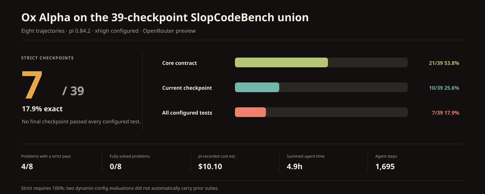
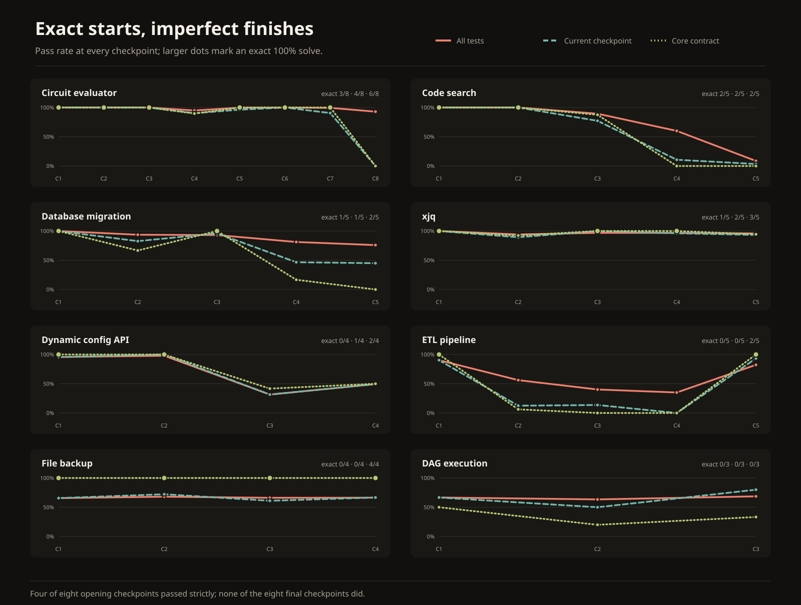
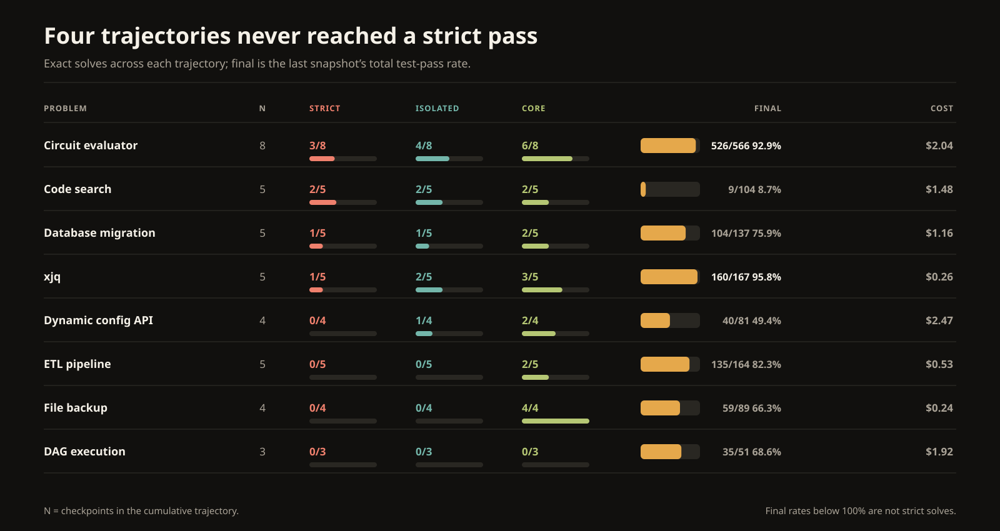
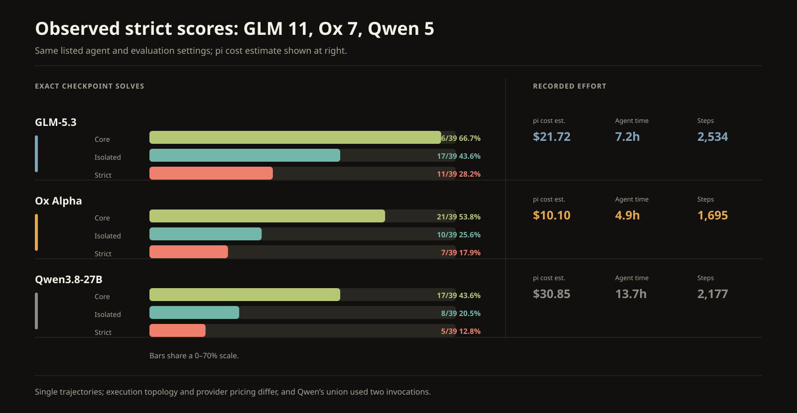
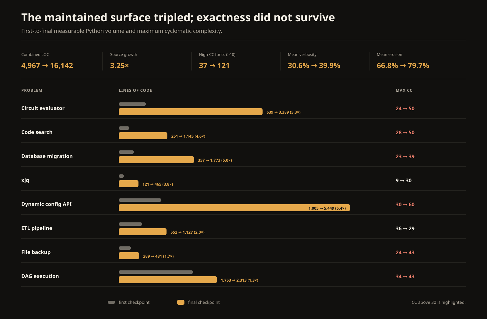

# Benchmarking Ox Alpha with pi on SlopCodeBench



## Seven strict passes, all before checkpoint 4

Ox Alpha strictly solved **7 of 39 checkpoints (17.9%)** across eight
cumulative coding trajectories. It solved 10 checkpoints when inherited
regressions were excluded and 21 at the narrower core-contract level. Four of
eight problems had at least one strict pass; none passed strictly at its final
checkpoint.

This is the same 39-checkpoint union used in the published Qwen report and a
matching slice of the full-catalogue GLM run. Under the same listed agent and
evaluation settings, Ox’s observed strict score was two checkpoints above
Qwen’s and four below GLM’s. Its pi-recorded cost estimate was also lower in
these runs.

The maintenance result matters more than that ordering: **all seven strict
passes arrived by checkpoint 3, and no final checkpoint passed strictly**.

| Metric | Result |
| --- | ---: |
| Strict checkpoints | **7/39 (17.9%)** |
| Isolated checkpoints | **10/39 (25.6%)** |
| Core checkpoints | **21/39 (53.8%)** |
| Fully solved problems | **0/8** |
| Problems with a strict pass | **4/8** |
| Mean checkpoint test-pass rate | **79.9%** |
| pi-recorded cost estimate | **$10.1010** |
| Summed agent time | **4h 57m** |
| Agent steps | **1,695** |
| Output tokens | **825,474** |

The 79.9% row is the unweighted mean of 39 checkpoint-level total pass rates,
not a pooled test rate. The evaluator retained 63 skipped outcomes in the
relevant checkpoint denominators and did not count them as passed. The exact
7/10/21 solve counts are unaffected because every checkpoint with skips also
had genuine failures.

## How to read the score

Each SlopCodeBench problem is an evolving repository. The agent sees one new
specification at a time and continues from the workspace it produced at the
previous checkpoint.

The evaluator exposes three exact thresholds:

- **Strict:** every test configured for the checkpoint passes, including prior
  tests when they are carried forward.
- **Isolated:** every current-checkpoint test passes after excluding inherited
  regressions.
- **Core:** every test for the explicit central contract passes.

These are 100% thresholds. A result of 526/529 is close, but it is not solved.
Skipped outcomes remain in the aggregate denominator as not passed. For
unattended maintenance, strict is the meaningful headline: a small old defect
is still a defect.

Two evaluations—`dynamic_config_service_api` checkpoints 3 and 4—were
configured with `include_prior_tests: false`. Their workspaces still
accumulated, but the evaluator did not automatically carry forward prior
checkpoint suites. Checkpoint 4’s current suite still embedded selected
regression cases. The published
[`checkpoint_metadata.csv`](data/ox-alpha-pi-xhigh-2026-08-20/checkpoint_metadata.csv)
identifies both resets. Neither checkpoint passed strictly, so the reset does
not increase the headline count.

## What I ran

| Setting | Value |
| --- | --- |
| Model | `openrouter/stealth/ox-alpha` |
| Disclosed model identity | None; only the preview alias was exposed |
| Agent | pi 0.84.2 |
| Reasoning | configured xhigh; pi’s runtime environment reported `high` |
| Prompt | SlopCodeBench `just-solve` |
| Environment | Python 3.12 in Docker |
| Pass policy | `all-cases` |
| Seed | 42 |
| Cost / step limit | none |
| Per-attempt process timeout | 7,200 seconds |
| Problem catalogue | `v1.0` at `4d38d300` |

All eight problem workers ran concurrently, with checkpoint evaluation also
allowed to overlap inference. The inference window was 69m 42s; summed agent
time was 4h 57m because the trajectories overlapped. All 39 expected
checkpoints ran and were evaluated.

Three retained event streams begin at a continuation prompt because the
harness overwrote the original attempt on retry. That limits attempt-level
forensics, not test scoring or the retained usage totals. The runner also did
not record its own git revision. Its publication-time workspace was dirty, so
an exact source rerun cannot be guaranteed; the effective configuration and
container digests are published in the
[`source_manifest.json`](data/ox-alpha-pi-xhigh-2026-08-20/source_manifest.json).

The run consumed 27.64M input tokens, including 24.63M cache-read tokens, and
825,474 output tokens. The response-level `usage.cost` fields emitted by pi sum
to $10.101016. Pi derives those fields from its runtime model pricing; the
published fallback model-pricing configuration was zero, and raw provider
billing telemetry was not retained. Treat this as a pi-recorded estimate, not
proof of the final invoiced amount.

## Results by problem

| Problem | Checkpoints | Strict | Isolated | Core | Final tests passing | Cost estimate |
| --- | ---: | ---: | ---: | ---: | ---: | ---: |
| `circuit_eval` | 8 | **3/8** | **4/8** | **6/8** | 526/566 (92.9%) | $2.04 |
| `database_migration` | 5 | **1/5** | **1/5** | **2/5** | 104/137 (75.9%) | $1.16 |
| `dynamic_config_service_api` | 4 | **0/4** | **1/4** | **2/4** | 40/81 (49.4%) | $2.47 |
| `xjq` | 5 | **1/5** | **2/5** | **3/5** | 160/167 (95.8%) | $0.26 |
| `file_backup` | 4 | **0/4** | **0/4** | **4/4** | 59/89 (66.3%) | $0.24 |
| `dag_execution` | 3 | **0/3** | **0/3** | **0/3** | 35/51 (68.6%) | $1.92 |
| `code_search` | 5 | **2/5** | **2/5** | **2/5** | 9/104 (8.7%) | $1.48 |
| `etl_pipeline` | 5 | **0/5** | **0/5** | **2/5** | 135/164 (82.3%) | $0.53 |
| **Total** | **39** | **7/39** | **10/39** | **21/39** | — | **$10.10** |



The seven strict passes were concentrated in four strong starts:
`circuit_eval` checkpoints 1–3, `code_search` checkpoints 1–2, and the opening
checkpoints of `database_migration` and `xjq`.

### The circuit trajectory recovered to near-strict, then skipped the final feature

`circuit_eval` began with three perfect evaluations: 36/36, 99/99, and
205/205. Checkpoint 4 then preserved all 205 inherited tests but missed 22 new
three-valued logic cases, including MUX and reduction semantics.

The trajectory recovered sharply. Checkpoint 5 passed 456/457, checkpoint 6
passed every new test while retaining the one inherited failure, and checkpoint
7 reached 526/529. The remaining defects were narrow output and error-contract
details.

Checkpoint 8 was different. The agent spent 29 steps and nearly seven minutes
using shell commands, but changed no file. Every one of the 37 new optimisation
tests failed because the required `opt` command did not exist. The snapshot
still passed 526 of 529 inherited tests, so its total pass rate looked healthy
at **92.9%**.

That row is a compact argument against reporting mean test pass rate alone. A
system can pass almost 93% of a large cumulative suite while implementing none
of the new requirement.

### Four checkpoints produced no code change

Four loops ended with an empty file diff:

- `code_search` checkpoint 4 stopped after 4.4 seconds and four recorded steps;
  it passed only 3/28 current tests and 0/14 current core tests.
- `circuit_eval` checkpoint 8 left the entire optimisation command absent.
- `database_migration` checkpoint 5 changed no code. The expanded evaluation
  produced 104/137: 95 inherited passes and 9/20 current passes.
- `file_backup` checkpoint 4 also changed nothing. Its existing code happened
  to pass the single new core test, but only 14/21 current tests overall.

Three of those were final checkpoints. A no-change loop is not automatically a
failure—the inherited implementation can already satisfy part of a new
specification—but here none produced an isolated or strict solve.

`code_search` then showed the opposite failure mode. After the checkpoint-4
no-op, checkpoint 5 spent 126 steps, added 608 lines, and removed 121. The final
snapshot passed only **9/104 tests**, including 8/75 inherited tests. More
activity did not repair the missing selector feature; it also displaced
previously working search behaviour.

### Recovery was possible, but it did not become exact

`etl_pipeline` fell from 37/41 at checkpoint 1 to 47/134 at checkpoint 4. Its
final rewrite removed 715 lines and added 226, then recovered to **135/164**.
It passed all four new core tests and 28/30 current tests, but only 107/134
inherited tests survived. The recovery was substantial and still not strict.

`xjq` was steadier. It opened with a strict pass, passed checkpoint 3 in
isolation, and
finished at **160/167**. Seven output-contract defects remained: four inherited
text-extraction cases and three new compact-JSON or mixed-query cases. GLM,
Qwen, and Ox all finished this problem near 96%; none was exact.

### Core success often hid an incomplete feature

The overall funnel drops from 21 core solves to 10 isolated solves, a **28.2
percentage-point** loss. The next drop—from 10 isolated to 7 strict—is only
**7.7 points**. On this sample, completing the full current requirement beyond
its central contract was a larger observed gap than regression alone.

`file_backup` is the clearest case: **4/4 core, 0/4 isolated, 0/4 strict**.
Scheduling boundaries, glob behaviour, and exact event payloads remained
incomplete around a consistently working centre.

The dynamic configuration service shows the regression version of the problem.
At checkpoint 2, all 46 current tests passed, but two checkpoint-1 status-code
defects remained: operations that required a 409 response returned 404. That
single inherited pair prevented a strict pass before the trajectory broadened
into proposals and policy evaluation.



## Compared with GLM and Qwen on the same 39 checkpoints



| System | Strict | Isolated | Core | pi cost est. | Agent time | Steps |
| --- | ---: | ---: | ---: | ---: | ---: | ---: |
| GLM-5.3 | **11/39** | **17/39** | **26/39** | $21.72 | 7.2h | 2,534 |
| **Ox Alpha** | **7/39** | **10/39** | **21/39** | **$10.10** | **4.9h** | **1,695** |
| Qwen3.8-27B | **5/39** | **8/39** | **17/39** | $30.85 | 13.7h | 2,177 |

This is the closest comparison available. All three rows configured pi 0.84.2,
xhigh reasoning, the `just-solve` prompt, `all-cases`, Python 3.12 in Docker,
and the same problem-catalogue commit. Run composition and execution topology
were not identical: GLM is filtered from one complete-catalogue run, Ox used
eight concurrent workers, and Qwen’s union was pooled from two invocations.

Ox’s observed counts sit between the other systems at every 100% threshold. It
recorded two more strict solves and four more core solves than Qwen, while GLM
led Ox by four strict and five core solves. Ox also used fewer steps, less
summed time, and a lower pi-recorded cost estimate in these runs.

Do not turn that observation into a precise model ranking. Each row contains
one trajectory per problem, provider pricing and serving speed differ, and
there are no replicates. The Ox label is an additional limitation: OpenRouter
exposed a stealth preview alias, not the identity of the underlying weights.
This is a comparison of three observed systems, not a variance-controlled
estimate of three models.

## Code growth and structural pressure



Across the eight opening snapshots, the solutions contained 4,967 lines of
measurable Python. The final snapshots contained 16,142: **3.25× as much**.
Functions above the benchmark’s high-complexity threshold of cyclomatic
complexity greater than 10 rose from 37 to 121. Mean first-to-final verbosity
rose from 30.6% to 39.9%, and structural erosion from 66.8% to 79.7%. These are
unweighted means across the eight first or final snapshots. `scb-check 0.1.3`
defines verbosity as the fraction of Python SLOC covered by the union of clone,
ast-grep, and trivial-wrapper findings, and erosion as the share of complexity
mass held by
high-complexity functions. The figure separately highlights a snapshot’s
maximum cyclomatic complexity when it exceeds 30.

Source growth is expected because later specifications require more behaviour.
These static measures are directional, not an oracle for maintainability, and
they include measurable agent-authored test code as well as implementation
code. The concerning combination is growth without durable exactness: no final
checkpoint passed strictly, while maximum cyclomatic complexity rose in seven
of eight trajectories.

The two largest maintained surfaces were also ambitious ones.
`dynamic_config_service_api` grew from 1,005 to 5,449 lines and reached a
maximum cyclomatic complexity of 60; `circuit_eval` grew from 639 to 3,389
lines and reached 50. The circuit implementation retained most of its old
behaviour. The configuration service did not convert its breadth into a strict
checkpoint.

## What I take away

Ox Alpha was a capable bounded implementer on this sample. It produced seven
strict checkpoints, held the core contract in more than half of the run, kept
`circuit_eval` near strict through seven stages, and reached that result with
a lower pi-recorded cost estimate and less effort than the two comparison
systems.

It was not a reliable lights-out maintainer. Exactness was concentrated at the
start, three final loops made no code change, the largest loss came between core
and full current-checkpoint behaviour, and no trajectory finished strictly
correct.

The defensible result is narrow: this Ox Alpha preview, under pi 0.84.2 with
xhigh configured, recorded the middle strict count among these three observed
systems on the shared 39-checkpoint set. The undisclosed weights, single
trajectories, and absence of replicates make broader claims speculative.

## Data and figure reproduction

The published dataset is under
[`data/ox-alpha-pi-xhigh-2026-08-20/`](data/ox-alpha-pi-xhigh-2026-08-20/).
It includes:

- the aggregate result and all 39 checkpoint records;
- chart-ready checkpoint and problem CSVs;
- passed, failed, and skipped outcome counts for every evaluation;
- selected evaluator and diff diagnostics;
- compact summaries of all retained pi event streams;
- problem and checkpoint metadata, including prior-test policy;
- the historical source-root launcher and exact CLI flags, normalised
  configuration, container digests, and SHA-256 source-artifact lineage.

Regenerate both CSVs and all five SVG figures with only the Python standard
library:

```bash
python scripts/render_ox_alpha_charts.py \
  data/ox-alpha-pi-xhigh-2026-08-20
```

## Sources

- [SlopCodeBench paper](https://arxiv.org/abs/2603.24755)
- [SlopCodeBench runner](https://github.com/SprocketLab/slop-code-bench)
- [SlopCodeBench problem catalogue](https://github.com/gabeorlanski/scb-problems)
- [Benchmarking GLM-5.3 with pi on the full catalogue](glm-5.3-pi-on-slop-code-bench.md)
- [Benchmarking Qwen3.8-27B with pi](qwen3.8-27b-pi-on-slop-code-bench.md)
- [Benchmarking Opus 5 on SlopCodeBench](https://github.com/humanlayer/advanced-context-engineering-for-coding-agents/blob/f2bc7aec4575418d2d2e83fec078266cc56d3e6a/benchmarking-opus-5-on-slop-code-bench.md)
- [Benchmarking Fable, Sol, and Kimi K3 on SlopCodeBench](https://github.com/humanlayer/advanced-context-engineering-for-coding-agents/blob/f2bc7aec4575418d2d2e83fec078266cc56d3e6a/benchmarking-sol-fable-kimi-on-slop-code-bench.md)
