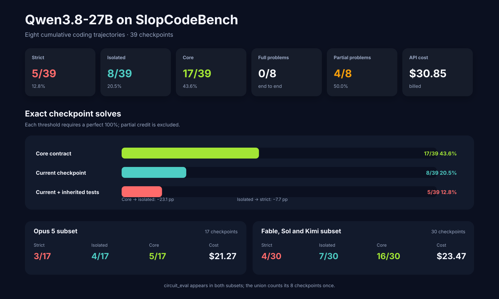
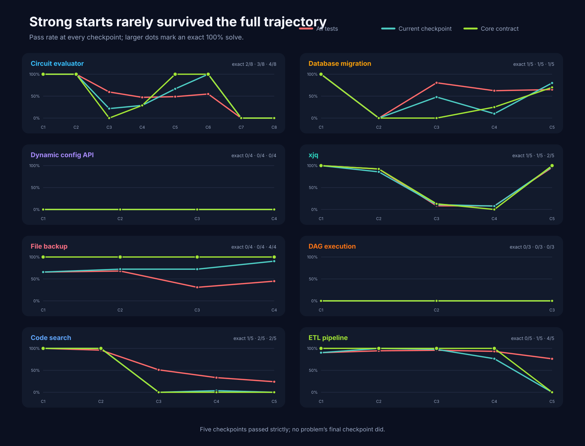
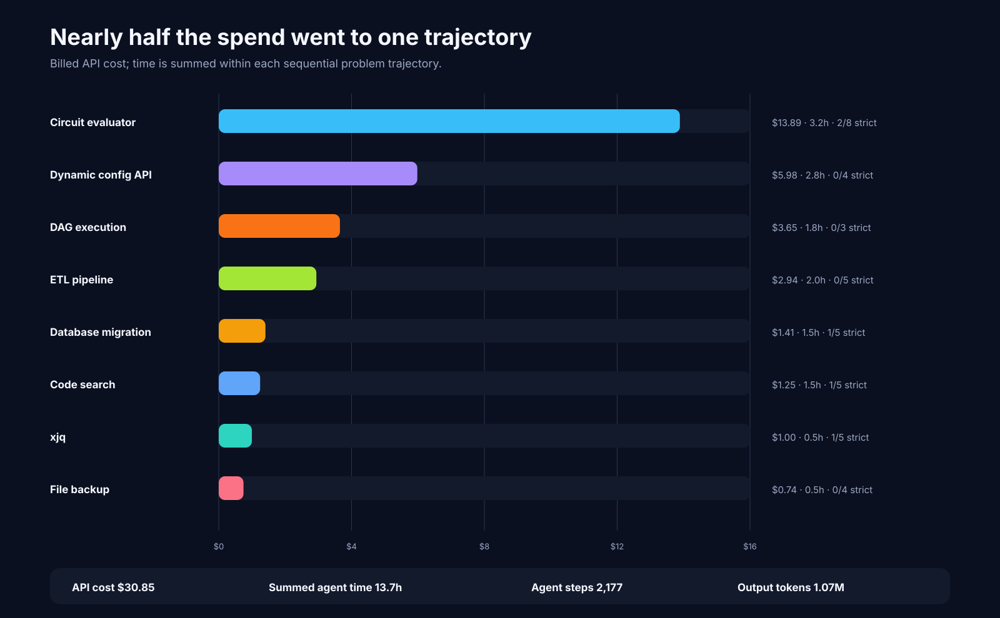
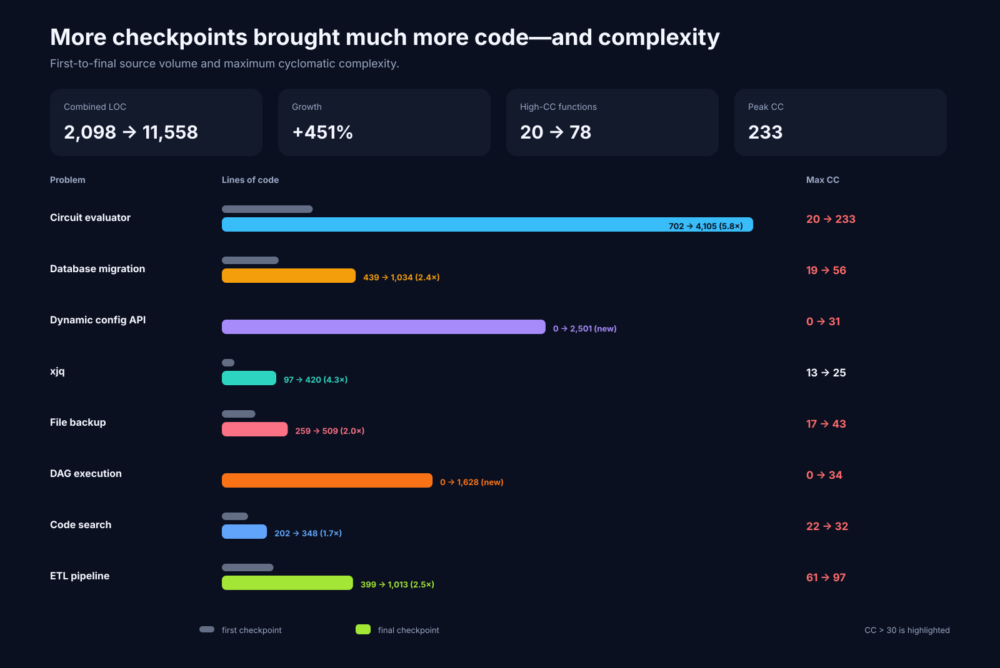
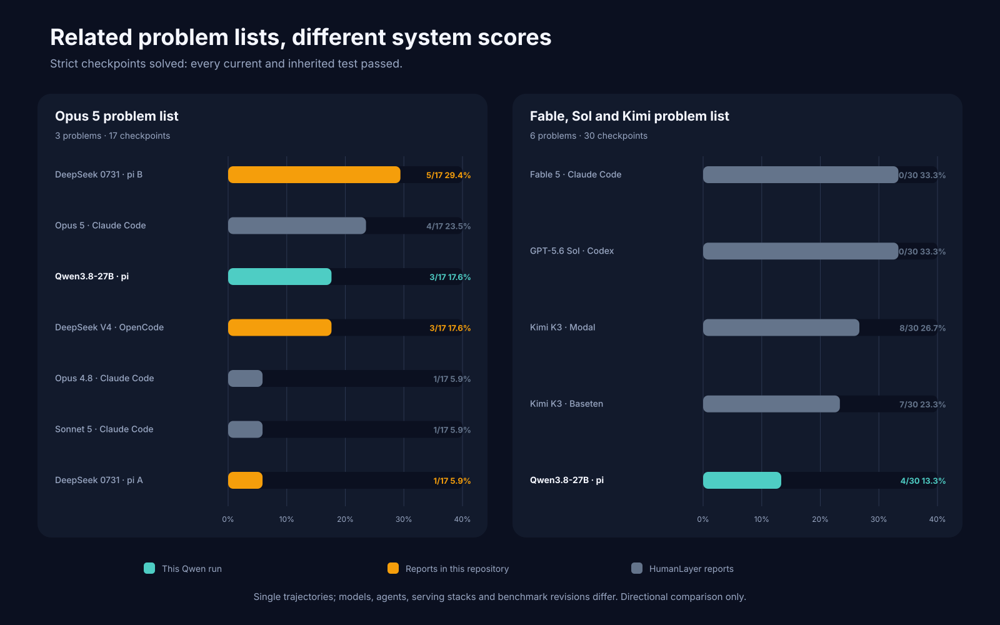

# Benchmarking Qwen3.8-27B with pi on SlopCodeBench



## Qwen could build the center of a feature; maintaining the whole system was harder

Qwen3.8-27B strictly solved **5 of 39 checkpoints (12.8%)**. It solved 8
checkpoints when regressions were excluded and 17 at the narrower core-contract
level. Four of eight problems had at least one strict pass, but none remained
fully correct from beginning to end.

That gap is the result. The model often understood the requirement in front of
it. It was much less reliable at extending the implementation while preserving
every behavior accumulated earlier in the trajectory.

| Metric | Result |
| --- | ---: |
| Strict checkpoints | **5/39 (12.8%)** |
| Isolated checkpoints | **8/39 (20.5%)** |
| Core checkpoints | **17/39 (43.6%)** |
| Fully solved problems | **0/8** |
| Partially solved problems | **4/8** |
| Billed API cost | **$30.8541** |
| Summed agent time | **13h 43m** |
| Agent steps | **2,177** |
| Output tokens | **1.07M** |

## What I ran

The dataset covers the union of the two SlopCodeBench subsets used in the
linked HumanLayer reports: eight problems and 39 unique checkpoints.
`circuit_eval` appears in both subsets and is counted once.

| Setting | Value |
| --- | --- |
| Model | `qwen/qwen3.8-27b` through OpenRouter |
| Agent | pi 0.84.2 |
| Reasoning | xhigh |
| Prompt | SlopCodeBench `just-solve` |
| Environment | Python 3.12 in Docker |
| Pass policy | `all-cases` |
| Seed | 42 |
| Cost / step limit | none |
| Process timeout | 7,200 seconds |
| Problem catalogue | `v1.0` at `4d38d300` |

Each problem is cumulative: checkpoint 2 starts from the code produced at
checkpoint 1, checkpoint 3 starts from checkpoint 2, and so on. Later
requirements are hidden until their checkpoint begins. Held-out tests then
measure both the new behavior and everything inherited from earlier work.

The evaluator exposes three useful thresholds:

- **Strict:** every current and inherited test passes.
- **Isolated:** every current-checkpoint test passes, excluding regressions.
- **Core:** every core test for the explicit contract passes.

Core asks whether the visible center of the requirement works. Strict asks
whether the agent maintained the entire evolving system without leaving a
defect behind. For unattended software maintenance, strict is the meaningful
headline. Configured checkpoints never disappear from the denominator; an
incomplete evaluator row remains unsolved under `all-cases`.

The normalized [configuration](data/qwen3.8-27b-pi-xhigh-2026-08-19/config.yaml),
[source manifest](data/qwen3.8-27b-pi-xhigh-2026-08-19/source_manifest.json),
[aggregate](data/qwen3.8-27b-pi-xhigh-2026-08-19/result.json), and
[checkpoint-level records](data/qwen3.8-27b-pi-xhigh-2026-08-19/checkpoint_results.jsonl)
are published with this report.

## Results by problem

| Problem | Checkpoints | Strict | Isolated | Core | Cost | Agent time |
| --- | ---: | ---: | ---: | ---: | ---: | ---: |
| `circuit_eval` | 8 | **2/8** | **3/8** | **4/8** | $13.89 | 3.2h |
| `database_migration` | 5 | **1/5** | **1/5** | **1/5** | $1.41 | 1.5h |
| `dynamic_config_service_api` | 4 | **0/4** | **0/4** | **0/4** | $5.98 | 2.8h |
| `xjq` | 5 | **1/5** | **1/5** | **2/5** | $1.00 | 0.5h |
| `file_backup` | 4 | **0/4** | **0/4** | **4/4** | $0.74 | 0.5h |
| `dag_execution` | 3 | **0/3** | **0/3** | **0/3** | $3.65 | 1.8h |
| `code_search` | 5 | **1/5** | **2/5** | **2/5** | $1.25 | 1.5h |
| `etl_pipeline` | 5 | **0/5** | **1/5** | **4/5** | $2.94 | 2.0h |
| **Total** | **39** | **5/39** | **8/39** | **17/39** | **$30.85** | **13.7h** |



All five strict passes arrived in the first two checkpoints of a problem:
`circuit_eval` 1–2 and checkpoint 1 of `database_migration`, `code_search`, and
`xjq`. No final checkpoint passed strictly.

The trajectory was not simply a steady decline, though. Three patterns stand
out. Selected failing test IDs and evaluator evidence for the examples below
are published in [`diagnostics.jsonl`](data/qwen3.8-27b-pi-xhigh-2026-08-19/diagnostics.jsonl).

### Good foundations did not guarantee good extensions

`circuit_eval` opened with perfect 36/36 and 99/99 test runs. It later recovered
the core contract at checkpoints 5 and 6, and checkpoint 6 passed in isolation,
but inherited failures kept it from another strict solve.

`code_search` followed a similar, shorter arc. Exact and regular-expression
search worked at checkpoint 1, and the multilingual extension passed in
isolation at checkpoint 2. Structural patterns, selectors, fixes, and the later
language expansion never reached the same level of completeness.

`database_migration` passed its 39-test opening checkpoint. Later work added
parts of data migration, rollback, constraints, and dependency handling, but
the final CLI still rejected required dependency options and retained
unsupported migration operations.

### Core correctness often stopped short of usable behavior

`file_backup` is the clearest example: **4/4 core**, but **0/4 isolated** and
**0/4 strict**. The implementation repeatedly captured the main contract while
missing scheduling boundaries, event shapes, destination behavior, or inherited
cases around it.

`etl_pipeline` passed core at its first four checkpoints and came close on total
test rates, yet never earned a strict pass. Checkpoint 2 was its only isolated
solve. A late validator and expression-engine refactor preserved 125 inherited
tests but failed every new core, functionality, and error group at checkpoint
5.

The 17 → 8 drop from core to isolated is larger than the 8 → 5 drop from
isolated to strict. On this sample, the biggest problem was not regression alone;
it was completing the full visible requirement beyond its narrow center.

### Recovery was possible

`xjq` fell from a perfect checkpoint 1 to very low pass rates in the middle,
then recovered to **160/167 tests at checkpoint 5**. Its remaining defects were
small output-contract details around whitespace, joined elements, and empty
text. That recovery did not become a strict pass, but it is useful evidence
that an early defect did not make the rest of a trajectory irrecoverable.

The opposite failure mode appeared in the two zero-score problems.
`dag_execution` grew into a substantial package but never supplied the required
`launch.py` entrypoint, so the evaluator could not exercise its implementation.
The dynamic configuration service accumulated a large API implementation, but
startup and dependency packaging remained broken. Breadth inside the repository
could not compensate for a missing executable contract.

## Cost and effort



The run used **31.68M input tokens**, **1.07M output tokens**, and **662,647
reasoning tokens** across 2,177 agent steps.

Spend was highly concentrated:

- `circuit_eval` cost **$13.89**, or 45.0% of the total.
- `dynamic_config_service_api` cost **$5.98**, or 19.4%.
- Together they consumed **64.4% of the bill**.
- The four least expensive trajectories cost $4.40 combined and produced three
  of the five strict passes.

Cost is not a quality metric, but the distribution is instructive. Expensive
checkpoints clustered in trajectories that were already below strict. In this
small sample, higher spend did not coincide with reliable recovery.

## Code growth



Across the eight first snapshots, the solutions contained 2,098 lines of
measurable Python. The eight final snapshots contained 11,558: **5.5× as much
code**. Functions above the benchmark’s high-complexity threshold rose from 20
to 78, and the maximum cyclomatic complexity reached 233 in `circuit_eval`.

Later checkpoints genuinely require more behavior, so source growth is not a
defect by itself. The worrying combination is growth without durable
correctness: no problem finished strictly correct while complexity increased
across nearly every implemented trajectory.

These static measures are directional, not an oracle for maintainability. They
are still useful beside the test results because they show the shape of the
code the next checkpoint had to inherit.

## Comparison with the published subsets



On the three-problem, 17-checkpoint subset from
[HumanLayer’s Opus 5 report](https://github.com/humanlayer/advanced-context-engineering-for-coding-agents/blob/f2bc7aec4575418d2d2e83fec078266cc56d3e6a/benchmarking-opus-5-on-slop-code-bench.md),
Qwen scored **3/17 strict**:

| Reported system | Strict |
| --- | ---: |
| DeepSeek V4 Flash 0731 · pi, run B | 5/17 (29.4%) |
| Opus 5 · Claude Code | 4/17 (23.5%) |
| **Qwen3.8-27B · pi** | **3/17 (17.6%)** |
| DeepSeek V4 Flash · OpenCode | 3/17 (17.6%) |
| Opus 4.8 · Claude Code | 1/17 (5.9%) |
| Sonnet 5 · Claude Code | 1/17 (5.9%) |
| DeepSeek V4 Flash 0731 · pi, run A | 1/17 (5.9%) |

On the six-problem, 30-checkpoint subset from
[HumanLayer’s Fable, Sol, and Kimi report](https://github.com/humanlayer/advanced-context-engineering-for-coding-agents/blob/f2bc7aec4575418d2d2e83fec078266cc56d3e6a/benchmarking-sol-fable-kimi-on-slop-code-bench.md),
Qwen scored **4/30 strict**:

| Reported system | Strict |
| --- | ---: |
| Fable 5 · Claude Code | 10/30 (33.3%) |
| GPT-5.6 Sol · Codex | 10/30 (33.3%) |
| Kimi K3 · Modal / OpenCode | 8/30 (26.7%) |
| Kimi K3 · Baseten / OpenCode | 7/30 (23.3%) |
| **Qwen3.8-27B · pi** | **4/30 (13.3%)** |

These are system comparisons, not controlled model rankings. Every row is a
single trajectory. Models, agents, prompts, serving stacks, reasoning settings,
and dates differ. The shared `circuit_eval` suite also changed between the two
HumanLayer rounds—from 557 to 566 tests—so even the overlapping problem is not
perfectly identical.

The two DeepSeek reports make the same point from another angle. The hosted
OpenCode run scored 3/17 for $0.68. Two local pi runs scored 1/17 and 5/17 after
serving limits and quantization changed. A benchmark score describes the whole
system that produced it.

## What I take away

Qwen3.8-27B was capable of strong bounded implementation. It produced five
perfect checkpoints, recovered a nearly complete `xjq`, held the core contract
through four ETL stages, and implemented the core of every `file_backup`
checkpoint.

It was not a reliable lights-off maintainer on these trajectories. The visible
feature center passed more than three times as often as the whole inherited
system, no problem finished strictly correct, and the most ambitious solutions
often lost the executable or packaging details that made their internal work
usable.

The useful lesson is not that 12.8% is one immutable model score. It is that the
failure shape is concrete: incomplete edges around otherwise plausible cores,
small contracts carried forward as regressions, and large implementations that
still did not finish cleanly. Those are exactly the behaviors an incremental
benchmark is supposed to reveal.

## Data and reproduction

The full normalized dataset is under
[`data/qwen3.8-27b-pi-xhigh-2026-08-19/`](data/qwen3.8-27b-pi-xhigh-2026-08-19/):

- [`result.json`](data/qwen3.8-27b-pi-xhigh-2026-08-19/result.json) — aggregate
  metrics;
- [`checkpoint_results.jsonl`](data/qwen3.8-27b-pi-xhigh-2026-08-19/checkpoint_results.jsonl)
  — all 39 checkpoint records;
- [`checkpoints.csv`](data/qwen3.8-27b-pi-xhigh-2026-08-19/checkpoints.csv) —
  chart-ready fields;
- [`diagnostics.jsonl`](data/qwen3.8-27b-pi-xhigh-2026-08-19/diagnostics.jsonl)
  — selected evaluator evidence for the per-problem analysis;
- [`comparisons.json`](data/qwen3.8-27b-pi-xhigh-2026-08-19/comparisons.json) —
  cited scores used in the comparison figure;
- [`trajectory.jsonl`](data/qwen3.8-27b-pi-xhigh-2026-08-19/trajectory.jsonl) —
  compact agent-loop summaries;
- [`config.yaml`](data/qwen3.8-27b-pi-xhigh-2026-08-19/config.yaml) and
  [`source_manifest.json`](data/qwen3.8-27b-pi-xhigh-2026-08-19/source_manifest.json)
  — configuration and provenance.

Regenerate the CSV and all five figures with only the Python standard library:

```bash
python scripts/render_charts.py data/qwen3.8-27b-pi-xhigh-2026-08-19
```

## Sources

- [SlopCodeBench paper](https://arxiv.org/abs/2603.24755)
- [SlopCodeBench runner](https://github.com/SprocketLab/slop-code-bench)
- [SlopCodeBench problem catalogue](https://github.com/gabeorlanski/scb-problems)
- [Benchmarking Opus 5 on SlopCodeBench](https://github.com/humanlayer/advanced-context-engineering-for-coding-agents/blob/f2bc7aec4575418d2d2e83fec078266cc56d3e6a/benchmarking-opus-5-on-slop-code-bench.md)
- [Benchmarking Fable, Sol, and Kimi K3 on SlopCodeBench](https://github.com/humanlayer/advanced-context-engineering-for-coding-agents/blob/f2bc7aec4575418d2d2e83fec078266cc56d3e6a/benchmarking-sol-fable-kimi-on-slop-code-bench.md)
- [Benchmarking DeepSeek V4 Flash on SlopCodeBench](deepseek-v4-flash-on-slop-code-bench.md)
- [Running DeepSeek V4 Flash 0731 locally on SlopCodeBench](deepseek-v4-flash-0731-pi-on-slop-code-bench.md)
